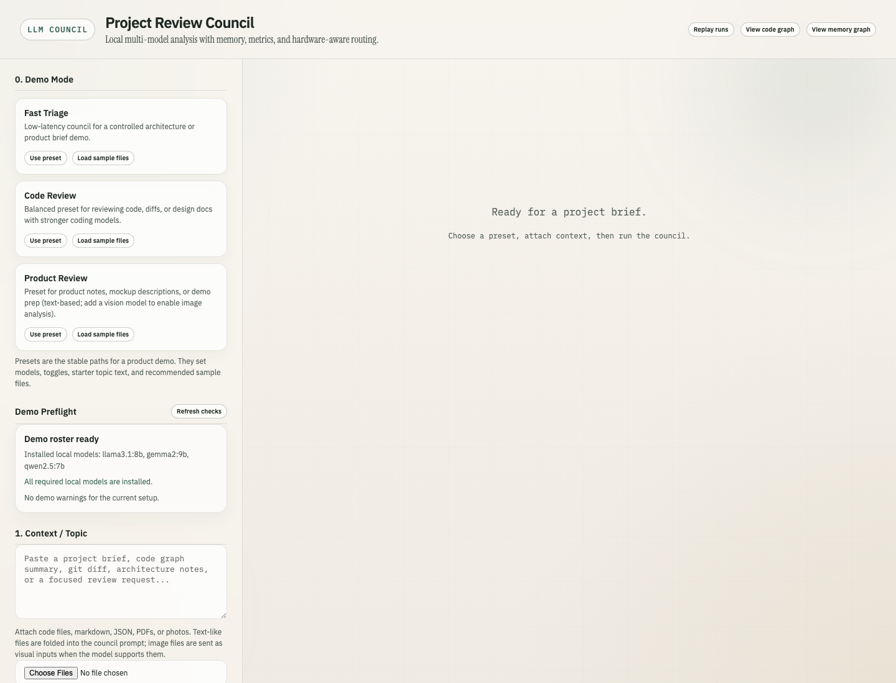

# 🐋 Local LLM Council

[](https://img.shields.io/badge/python-3.11%2B-blue)
[](https://img.shields.io/badge/license-MIT-green)
[](https://img.shields.io/badge/runtime-local--first-informational)
[](https://img.shields.io/badge/telemetry-zero-success)
[](https://github.com/sakethjaxx/local-llm-council/actions/workflows/test.yml)



An elegant, **local-first multi-model review council** that runs several local or optional cloud LLMs as a structured review board. Your code, topics, and files stay on your machine—never sent to third-party hosted orchestrators.

---

## ⚡ The Zero-Telemetry Guarantee

Unlike modern AI developer utilities, **Local LLM Council** is designed with privacy as a first-class citizen:
- **No Analytics Tracking:** Zero telemetry, tracking pixels, or user behavior profiling.
- **No Cloud Reporting:** Absolute zero background reporting, crash telemetry, or phone-home pings.
- **Client-Stored Secrets:** Cloud API keys are securely persisted solely in your browser's local `localStorage` context. They are only sent in standard runtime request headers directly to the API endpoints you designate, keeping them out of server logs.

---

## ✨ Key Features

- **3-Step Streamlined Flow:** Intuitively supply context, verify your expert seat roster, and launch the streaming council analysis.
- **Interactive Debate Chat:** Query individual expert seats directly inside the post-run debate terminal to probe decisions and explore code corrections.
- **Live Performance Auditing:** Real-time character/token decoding counts and streaming speed (Tokens/sec) indicators for every seat.
- **Dynamic Swarm & Deep Debate:** Toggle smart phases to auto-adapt your active roster based on context and let expert models critique and cross-review each other.
- **Automated Hardware Auto-Tune:** Single-click system RAM profiling to auto-configure optimized local models tailored for your device (supporting Economy, Balanced, and Quality presets).
- **Interactive Graphs:** Dynamic 2D pan/zoom network maps for local knowledge structures and project dependency code paths (powered by lazy-loaded Vis-network standalone rendering).

---

## 🚀 Quick Start

### 1. One-Line Install (Recommended)
Installs Python package + Ollama (if missing) in one step:

```bash
curl -fsSL https://raw.githubusercontent.com/sakethjaxx/local-llm-council/main/install.sh | bash
```

Then:

```bash
local-llm-council start
```

Open `http://localhost:8765`. On first launch, the CLI detects your RAM tier, lists missing models, and offers to pull them automatically.

---

### 2. The Developer Route (PyPI Package)
If you have Python installed, you can install the CLI globally or in an environment:

```bash
pip install local-llm-council
local-llm-council start
```

Open `http://localhost:8765` in your browser.

---

### 3. The Universal Route (Docker)
If you prefer a clean containerized sandbox process without installing Python:

```bash
# Pull and run the container (exposes port 8765)
docker run --rm -p 8765:8765 ghcr.io/sakethjaxx/local-llm-council:latest
```
*(Note: If you build the image locally with `docker build -t local-llm-council .`, you can replace the image name above.)*

> [!NOTE]
> Since the container runs inside its own network space, configure Ollama on the host to bind to all interfaces (`OLLAMA_HOST=0.0.0.0`) and set the client endpoint accordingly in the application settings.

---

### 4. Local Source Installation
For contributors or running from source:

```bash
# Clone the repository
git clone https://github.com/sakethjaxx/local-llm-council.git
cd local-llm-council

# Create and activate virtual environment
python3 -m venv venv
source venv/bin/activate

# Install requirements
pip install -r requirements.txt
cp env.example .env

# Launch the server
python main.py
```

## 📊 Project Comparison

| Project | Primary Focus | Local-First Focus | Differentiator |
| :--- | :--- | :---: | :--- |
| **Local LLM Council** | **Multi-Model Consensus & Decisions** | **Yes** | **Fully local browser interface, live token speeds, sqlite history replay, 2D code graphs, and zero telemetry.** |
| **CrewAI** | Agent role-based workflows | Partial | Strictly programmatic python-first team scripts. |
| **AutoGen** | Conversational agent frames | Partial | Focused on custom code-execution agent dialogues. |
| **LangGraph** | Complex stateful graph logic | Partial | Low-level developer runtime for customized flows. |

---

## ⚙️ Configuration & Environment Variables

Settings are configured via the `.env` file at the project root:

| Variable | Description | Default |
| :--- | :--- | :---: |
| `COUNCIL_HOST` | FastAPI server host binding interface | `127.0.0.1` |
| `COUNCIL_PORT` | FastAPI server port | `8765` |
| `COUNCIL_API_KEY` | Enforcement key required when exposing the app outside localhost | *None* |
| `COUNCIL_MAX_UPLOAD_MB` | Maximum single attachment upload cap | `20` |
| `COUNCIL_MAX_FILES` | Maximum attachments allowed per council run | `10` |
| `COUNCIL_ENABLE_PYTHON_TOOL` | Enables sandbox local Python execution tool | `False` |

---

## 🧪 Automated Testing

We maintain a full test suite built on `pytest`:

```bash
# Run lightweight unit tests
pytest tests/ -q
```

---

## 📄 License & Contributing

This project is licensed under the [MIT License](LICENSE). Contributions, bug reports, and pull requests are highly encouraged! Please review the [CONTRIBUTING.md](CONTRIBUTING.md) guide to get started.
